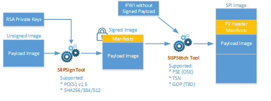

# Elkhart Lake Firmware and BIOS Utilities

This software contains tools and scripts to support binary modifications on UEFI BIOS images:

* **Signing Tool** (`siip_sign.py`): Signs an image according to SIIP specification
* **Stitching Tool** (`siip_stitch.py`): Stitches an image into an IFWI image according to UEFI Firmware File System format
* **Subregion Capsule Tool** (`subregion_capsule.py`): Creates a UEFI capsule image with subregion images according to an user defined configuration file

The flowchart with associated input and output files are illustrated in the following diagram:




All of these tools are command line driven scripts.


# Getting Started

## STEP 1: Setup Host Environment with Python

### Install Python 3.7.3 for Windows to `C:\Python37`

1. Download Python from: https://www.python.org/downloads/
2. Start installation and choose 'Customized Install'
3. Change install path to `C:\Python37`
4. Make sure pip and 'Add to PATH' are selected
5. Complete installation

Note: On Windows, files with extension `.py` may not associate to Python interpreter, e.g `*.py` is opened by text editor by default. Please fix that before running the script.


### Install Python Modules

Set PROXY environment if your host is behind proxy server:

```
  D:\tmp>set HTTP_PROXY=<...>
  D:\tmp>set HTTPS_PROXY=<...>
```

Install additional Python modules

```
  C:\Python37\Scripts\pip.exe install cryptography
```

Note: If there are multiple Python versions installed on the host, it is highly recommended to use virtualenv or pipenv before running the scripts.


## STEP 2: Collect Required Input Files

Before you are running scripts, please prepare the input files including images and signing keys

* IFWI image that contains Firmware Volume for the signed image identified by GUID and section UI string (e.g., `IFWI.bin`)
* RSA private key (e.g., `privkey.pem`) - The signing key used by BIOS for signing PEI modules and DXE drivers
* Payload image (e.g., `PseFw.bin`)
* Capsule certificate files used for capsule generation:
  - `TestCert.pem`
  - `TestRoot.pub.pem`
  - `TestSub.pub.pem`
* Capsule payload configuration files (e.g., `tsn_mac_address.json`)

## STEP 3: Run Script

Tip: Copying all inputs files to the same directory as the script is located makes it easier to execute the script.

All scripts are located inside `scripts` directory.

### Signing (output: `PseFw.signed.bin`)

```
  siip_sign.py sign -i PseFw.bin -o PseFw.signed.bin -k privkey.pem
```

### Stitching (output: `IFWI.new.bin`)

```
  siip_stitch.py -ip pse -o IFWI.new.bin IFWI.bin PseFw.bin
```

### Creating Sub Region Capsule Image (output: `capsule.out.bin`)

```
  subregion_capsule.py -o capsule.out.bin --signer-private-cert=TestCert.pem --other-public-cert=TestSub.pub.pem --trusted-public-cert=TestRoot.pub.pem tsn_mac_address.json
```

You are done here!


# Frequently Asked Questions

Who should use the scripts?
---------------------------
Anyone who needs to modify firmware or data in an IFWI Image or create a sub region capsule for the Elkhart Lake platform. Please consult documentation in the release package on the supported region types and features.

Do the scripts run in Python 2.7?
----------------------------------
No. Python 2.7 will be no longer be maintained past 2020 (see https://pythonclock.org/). Currently there is no plan to support Python 2.7.


Can I have multiple versions of Python installed in the system to run the scripts?
-----------------------------------------------------------------------------------
You may keep multiple versions of Python but it is highly recommended to use [`virtualenv`](https://virtualenv.pypa.io/en/stable/) or [`pipenv`](https://docs.pipenv.org/en/latest/) to setup the host environment then run the scripts inside the "contained" Python environment.


Where can I get the signing keys or certificates?
-------------------------------------------------
For security reasons, the official software release does not provide any signing keys or certificate files, which are required for generating capsule image or in some cases, stitching firmware into IFWI image. Typically these files are obtained from the owner of the firmware or capsule to be signed. For testing purpose, you can get certificate files for capsule tool from [here](https://github.com/tianocore/edk2/tree/master/BaseTools/Source/Python/Pkcs7Sign). **Note**: if the signing keys or certificate files are not supported by BIOS, the created image may not work or boot!


Following the instructions above, the script returns with errors. What should I do?
------------------------------------------------------------------------------------
It is recommended to take some steps to narrow down the problem first.

1. What is the first error message from output?
2. Have you installed python `cryptography` module?  --> run `python -c "import cryptography" to confirm`
3. Is the command line parameter correct? --> run `<script> -h` to get help message
4. Does any of input files exist or valid?


You generated the new image, but it does not work or boot. What should I do?
-----------------------------------------------------------------------------
This situation is more complex to trouble shoot. We should find the last known configuration first.

* Does the original image work or boot at all?
* Verify that the new changes are compatible with the original image?

Finally, contact technical support with the domain knowledge for help.


Do these scripts support graphic user interface (GUI)?
------------------------------------------------------
Not currently. These command line scripts only run inside terminal.

