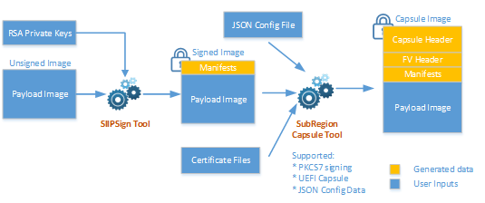

# Elkhart Lake SIIP Signing, Stitching and SubRegion Capsule Scripts

This project contains tools and scripts for signing, stitching and creating capsule output files for SIIP images (e.g. PSE) embedded in the BIOS region of IFWI images.

This package consists of three scripts:
* SIIP Sign Tool (`SIIPSign.py`): Sign a payload image according to SIIP specification
* SIIP Stitch Tool (`SIIPStitch.py`): Stitch a signed image into a full IFWI image
* Subregion Capsule Tool (`GenerateSubRegionCapsule.py`): Create a UEFI capsule image containing the signed image

The signing flow with associated input and output files are illustrated in the following diagram:





# Getting Started

## STEP 1: Installation

### Install Python 3.7.3 for Windows to `C:\Python37`

1. Download Python from: https://www.python.org/downloads/
2. Start installation and choose 'Customized Install'
3. Change install path to `C:\Python37`
4. Make sure pip and 'Add to PATH' are selected
5. Complete installation

Note: On Windows, files with extension `.py` may not associate to Python interpreter, e.g `*.py` is opened by text editor by default. Please fix that before running the script.

Note: This release does not include an installer for the Python scripts. Therefore, user should install Python and dependent modules using `pip` tool.


### Instal Python modules

Set PROXY environment if your host is behind proxy server:

```
  D:\tmp>set HTTP_PROXY=<...>
  D:\tmp>set HTTPS_PROXY=<...>
```

Install addiontional Python modules

```
  C:\Python37\Scripts\pip.exe install cryptography
```

## STEP 2: Prepare Input Files

Before you are running scripts, please prepare the input files including images and signing keys

* IFWI image that contains Firmware Volume for the signed image identified by GUID and section UI string (`BIOS.bin`)
* RSA private key (`privkey.pem`)
* Payload image to be signed (e.g. `OseFw.bin`)
* Capsule certificate files
  - `TestCert.pem`
  - `TestRoot.pub.pem`
  - `TestSub.pub.pem`
* Capsule payload configuration file (e.g. `TsnMacAddressDescExample.json`)

## STEP 3: Run Scripts

### Signing (output: `OseFw.signed.bin`)

```
  SIIPSign.py sign -i OseFw.bin -o OseFw.signed.bin -k privkey.pem
```
### Stitching (output: `IFWI.new.bin`)

**IMPORTANT**: copy `BIOS.bin` and `OseFw.signed.bin` into the directory `siipStitch`

```
  SIIPStitch.py -ip pse -o IFWI.new.bin BIOS.BIN OseFw.signed.bin
```

### Creating Capsule Image (output: `capsule.new.bin`)

Below is an example to create a capsule image from the JSON input file.

```
  GenerateSubRegionCapsule.py -o capsule.out.bin --signer-private-cert=TestCert.pem --other-public-cert=TestSub.pub.pem --trusted-public-cert=TestRoot.pub.pem TsnMacAddressDescExample.json
```

You are done here!
