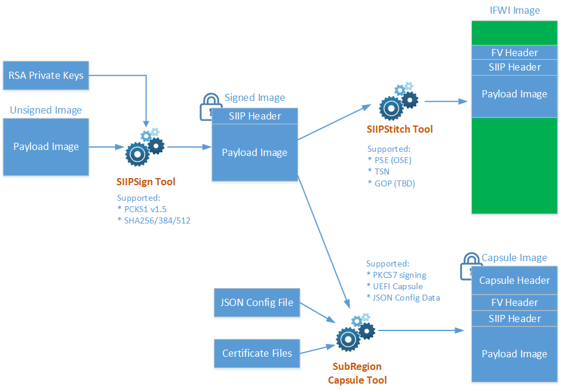

# Elkhart Lake SIIP Signing, Stitching and SubRegion Capsule Scripts

This project contains tools and scripts for signing, stitching and creating capsule output files for SIIP images (e.g. PSE) embedded in the BIOS region of IFWI images.

This package consists of three scripts:
* SIIP Sign Tool (`SIIPSign.py`): Sign a payload image according to SIIP specification
* SIIP Stitch Tool (`SIIPStitch.py`): Stitch a signed image into a full IFWI image
* Subregion Capsule Tool (`GenerateSubRegionCapsule.py`): Create a UEFI capsule image containing the signed image

The signing flow with associated input and output files are illustrated in the following diagram:




# Getting Started

## STEP 1: Installation

### Install Python 3.7.3 for Windows to `C:\Python37`

Download link: https://www.python.org/downloads/


Note: This release does not include an installer for the Python scripts. Therefore, user should install Python and dependent modules using `pip` tool.

### Install pip

Download [`get-pip.py`](https://bootstrap.pypa.io/get-pip.py) to a folder on your computer (`D:\tmp`)

Set PROXY environment if your host is behind proxy server:

```
  D:\tmp>set HTTP_PROXY=<...>

  D:\tmp>set HTTPS_PROXY=<...>

  D:\tmp>C:\Python37\python.exe get-pip.py
  Collecting pip
    Downloading https://files.pythonhosted.org/packages/5c/e0/be401c003291b56efc55aeba6a80ab790d3d4cece2778288d65323009420/pip-19.1.1-py2.py3-none-any.whl (1.4MB)
       |████████████████████████████████| 1.4MB 2.2MB/s
  Collecting wheel
    Downloading https://files.pythonhosted.org/packages/bb/10/44230dd6bf3563b8f227dbf344c908d412ad2ff48066476672f3a72e174e/wheel-0.33.4-py2.py3-none-any.whl
  Installing collected packages: pip, wheel
    Found existing installation: pip 19.0.3
      Uninstalling pip-19.0.3:
        Successfully uninstalled pip-19.0.3
    WARNING: The script wheel.exe is installed in 'C:\Python37\Scripts' which is not on PATH.
    Consider adding this directory to PATH or, if you prefer to suppress this warning, use --no-warn-script-location.
  Successfully installed pip-19.1.1 wheel-0.33.4

  D:\tmp>C:\Python37\Scripts\pip.exe -V
  pip 19.1.1 from c:\python37\lib\site-packages\pip (python 3.7)

```

`pip` is installed!

### Instal Python modules

```
  C:\Python37\Scripts\pip.exe install cryptography
```

## STEP 2: Prepare Input Files

Before you are running scripts, please prepare the input files including images and signing keys

* IFWI image that contains Firmware Volume for the signed image identified by GUID and section UI string (`BIOS.bin`)
* RSA private key (`privkey.pem`)
* Payload image to be signed (e.g. `OseFw.bin`)
* Capsule certificate files
  - `TestCert.pem`
  - `TestRoot.pub.pem`
  - `TestSub.pub.pem`
* Capsule payload configuration file (e.g. `TsnMacAddressDescExample.json`)

## STEP 3: Run Scripts

### Signing (output: `OseFw.signed.bin`)

```
  SIIPSign.py sign -i OseFw.bin -o OswFw.signed.bin -k privkey.pem
```
### Stitching (output: `IFWI.new.bin`)

**IMPORTANT**: copy `BIOS.bin` and `OseFw.signed.bin` into the directory `siipStitch`

```
  SIIPStitch.py -k privkey.pem -ip pse -o IFWI.new.bin BIOS.BIN OswFw.signed.bin
```

### Creating Capsule Image (output: `capsule.new.bin`)

```
  GenerateSubRegionCapsule.py -o capsule.out.bin --signer-private-cert=TestCert.pem --other-public-cert=TestSub.pub.pem --trusted-public-cert=TestRoot.pub.pem TsnMacAddressDescExample.json
```

You are done here!
