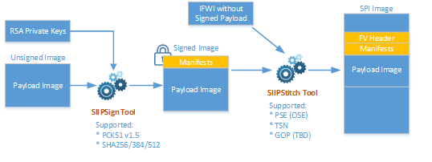

# Elkhart Lake Firmware and BIOS Utilities

This software contains tools and scripts to support binary modifications on UEFI BIOS images:

* **Signing Tool** (`siip_sign.py`): Signs an image according to SIIP specification
* **Stitching Tool** (`siip_stitch.py`): Stitches an image into an IFWI image according to UEFI Firmware File System format
* **Subregion Capsule Tool** (`subregion_capsule.py`): Creates a UEFI capsule image with subregion images according to an user defined configuration file

The flowchart with associated input and output files are illustrated in the following diagram:




All of these tools are command line driven scripts.


# Getting Started

## STEP 1: Setup Host Environment with Python

### Install Python 3.7.3 for Windows to `C:\Python37`

1. Download Python from: https://www.python.org/downloads/
2. Start installation and choose 'Customized Install'
3. Change install path to `C:\Python37`
4. Make sure pip and 'Add to PATH' are selected
5. Complete installation

### Install Python 3.7 for Ubuntu 18.04.3 LTS, for earlier versions manual installation might be required.
1. Install Python 3.7 using apt-get
```shell
    $ sudo apt update
    $ sudo apt install python3.7

```

2. Install Pip for Python 3
```shell
    $ sudo apt install python3-pip
```

Note: On Windows, files with extension `.py` may not associate to Python interpreter, e.g `*.py` is opened by text editor by default. Please fix that before running the script.


### Install Python Modules

Set PROXY environment if your host is behind proxy server:


For Windows
```shell
  D:\tmp>set HTTP_PROXY=<SERVER>:<PORT>
  D:\tmp>set HTTPS_PROXY=<SERVER>:<PORT>
```

For Linux
```shell
    $ export http_proxy=<SERVER>:<PORT>
    $ export https_proxy=<SERVER>:<PORT>
```


Install additional Python modules


For Windows
```shell
  C:\Python37\Scripts\pip.exe install cryptography
  C:\Python37\Scripts\pip.exe install click
```

For Linux

```shell
    $ python3.7 -m pip install --user cryptography
    $ python3.7 -m pip install --user click
```

Note: If there are multiple Python versions installed on the host, it is highly recommended to use virtualenv or pipenv before running the scripts.


## STEP 2: Collect Required Input Files

Before you are running scripts, please prepare the input files including images and signing keys

* IFWI image that contains Firmware Volume for the signed image identified by GUID and section UI string (e.g., `IFWI.bin`)
* RSA private key (e.g., `privkey.pem`) - The signing key used by BIOS for signing PEI modules and DXE drivers
* Payload image (e.g., `PseFw.bin`)
* Capsule certificate files used for capsule generation:
  - `TestCert.pem`
  - `TestRoot.pub.pem`
  - `TestSub.pub.pem`
* Capsule payload configuration files (e.g., `tsn_mac_address.json`)

## STEP 3: Run Script

Tip: Copying all inputs files to the same directory as the script is located makes it easier to execute the script.

All scripts are located inside `scripts` directory.

### Signing (output: `PseFw.signed.bin`)

```
  siip_sign.py sign -i PseFw.bin -o PseFw.signed.bin -k privkey.pem
```

### Stitching (output: `IFWI.new.bin`)

```
  siip_stitch.py -ip pse -o IFWI.new.bin IFWI.bin PseFw.bin
```

### Creating Sub Region Capsule Image (output: `capsule.out.bin`)

```
  subregion_capsule.py -o capsule.out.bin --signer-private-cert=TestCert.pem --other-public-cert=TestSub.pub.pem --trusted-public-cert=TestRoot.pub.pem tsn_mac_address.json
```

You are done here!


